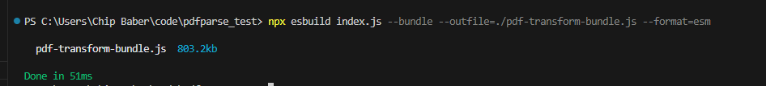
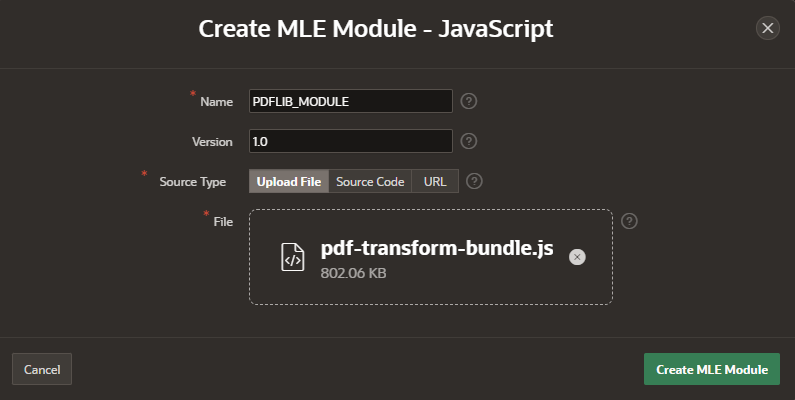
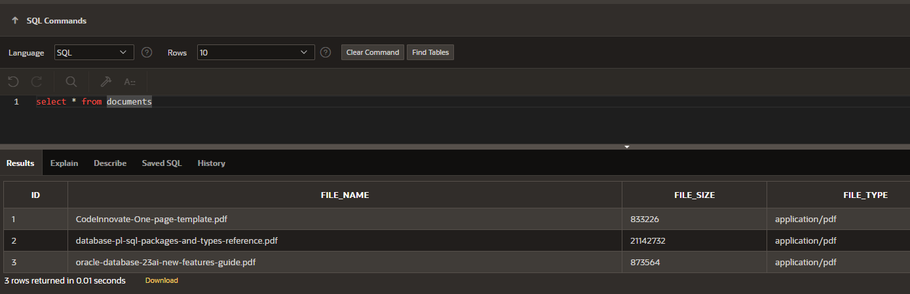
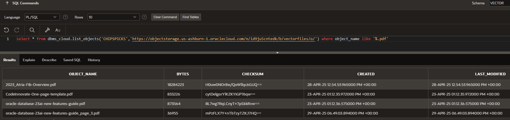

# Unlock the power of Node.js Code inside 23ai
In this video we will show how to quickly created a node.js function that inputs a pdf and outputs the number of pages inside the pdf as well as parses out a page in the pdf. We will then load this code directly into the 23ai database and show how easy it is to create oracle database functions on the node.js code that can be executed inside your database. 

This video and instructions assumes that the user: 

Has a 23ai autonomous database running on Oracle Cloud Infrastructure. 
Has developer access to an apex workspace. 
Has created an object storage bucket and a cloud credintial to access the bucket from your apex user. [How to create an Auth Token and Bucket](https://youtu.be/CvyzCjdDvTU)
Has Node.js installed locally able to execute in Visual Studio.

## 23ai Database Setup
- Capture the following information for future use in the code. Create a new bucket and capture the namespace & name in the fields below for future reference.
```
Database Username: 
Namespace: 
Bucket name: 
APEX Workspace Name: 

Ex. used in video
Database Username: vector
APEX Workspace Name: Vector
Namespace: id9ju5cntedk
Bucket name: vectorfiles
```

- Login to your Cloud console, navigate to your autonmous database and open SQL Developer Web. Grant the following to your database user.
```
grant execute dynamic mle to <database username>;
grant execute on javascript to <database username>;
grant create mle to <database username>;
grant db_developer_role to <database username>;

Ex. used in video
grant execute dynamic mle to vector;
grant execute on javascript to vector;
grant create mle to vector;
grant db_developer_role to vector;
```


- In a new tab login as your database user to your apex workspace. 


- Click on SQL* Worksheet


Then open SQL Commands


- Create the following table
```
 CREATE TABLE "DOCUMENTS" 
   (	"ID" NUMBER(*,0) GENERATED BY DEFAULT ON NULL AS IDENTITY MINVALUE 1 MAXVALUE 9999999999999999999999999999 INCREMENT BY 1 START WITH 1 CACHE 20 NOORDER  NOCYCLE  NOKEEP  NOSCALE  NOT NULL ENABLE, 
	"FILE_NAME" VARCHAR2(900), 
	"FILE_SIZE" NUMBER(*,0), 
	"FILE_TYPE" VARCHAR2(100), 
	"FILE_CONTENT" BLOB, 
	 PRIMARY KEY ("ID")
  USING INDEX  ENABLE
   );
```

- Test to see if you have a database credintial created. If not please review and create before proceeding. [How to create an Auth Token and Bucket](https://youtu.be/CvyzCjdDvTU)
    ```
    SELECT credential_name, username, comments FROM all_credentials;
    ```
    

- Test to see if you can view your pdf's in your bucket by running the query below. You must have at least one pdf in the bucket to proceed.
    ```
    select * from dbms_cloud.list_objects('<cloud credintial>','https://objectstorage.us-ashburn-1.oraclecloud.com/n/<bucket namespace>/b/<bucket name>/o/') where object_name like '%.pdf'
    Ex. used in video
    select * from dbms_cloud.list_objects('CHIPSPICKS','https://objectstorage.us-ashburn-1.oraclecloud.com/n/id9ju5cntedk/b/vectorfiles/o/') where object_name like '%.pdf'
    ```
    

- Now we will upload our pdfs from object storage into the database. To get started set your language to pl/sql. 
    
Then execute the following to load your documents from object storage into the database as a blob. The code block below will need to be updated with your credential and object storage link.
    ```
    declare
    l_blob blob := null;
    l_bucket varchar2(4000) := 'https://objectstorage.us-ashburn-1.oraclecloud.com/n/<bucket namespace>/b/<bucket name>/o/';
    begin
    for i in (select * from dbms_cloud.list_objects('<cloud credintial>',l_bucket) where object_name like '%.pdf')
    loop
    l_blob := dbms_cloud.get_object(
        credential_name => '<cloud credintial>',
        object_uri => l_bucket||i.object_name);
    insert into documents (file_name, file_size, file_type, file_content) values(i.object_name, i.bytes, 'application/pdf',l_blob);
    commit;
    end loop;
    end;
    ```
    Ex. used in video
    ```
    declare
    l_blob blob := null;
    l_bucket varchar2(4000) := 'https://objectstorage.us-ashburn-1.oraclecloud.com/n/id9ju5cntedk/b/vectorfiles/o/';
    begin
    for i in (select * from dbms_cloud.list_objects('CHIPSPICKS',l_bucket) where object_name like '%.pdf')
    loop
    l_blob := dbms_cloud.get_object(
        credential_name => 'CHIPSPICKS',
        object_uri => l_bucket||i.object_name);
    insert into documents (file_name, file_size, file_type, file_content) values(i.object_name, i.bytes, 'application/pdf',l_blob);
    commit;
    end loop;
    end;
    ```
    

- Query to make sure your documents loaded. 
    ```
    select * from documents
    ```
    

## Node.js Local Setup 
The section below is Node.js 101, but useful for this example as notes on steps to get your code bundled and loaded into Autonomous Database. 

- Install Node.js on your local machine. [https://nodejs.org/en/download](https://nodejs.org/en/download)

- Create a new folder. Create a package inside the folder. 
    ```
    npm init -y
    ```
    

- Check to see if any packages installed
    ```
    npm list
    ```
    

- Install pdf-lib libraries
    ```
    npm install pdf-lib
    ```
    


- (Optional) If you hit the error on installing then run:
    ```
    Get-ExecutionPolicy
    ```
    Then
    ```
    Set-ExecutionPolicy -Scope CurrentUser
    ```
    Set to 
    ```
    RemoteSigned
    ```

    

- Add an entry to the package.json that set the type to Module for the package.
    ```
    "type":"module",
    ```
    


- Create a new index.js file and copy code or copy over the index.js file from the git repo. [https://github.com/chipbaber/pdfparse/blob/main/index.js](https://github.com/chipbaber/pdfparse/blob/main/index.js)


- We will now run a simple test case, to simulate local development. Uncomment the test casebase64.
    

    It should look like:
    

- Run the test case locally. 
    ```
    node index.js
    ```
    You should see the following output. 
    

- Recomment the test case. 
    


- On local machine bundle up all the libraries required to execute the .js module. 
    ```
    npx esbuild index.js --bundle --outfile=./pdf-transform-bundle.js --format=esm
    ```
    

# Leveraging MLE with APEX in 23ai Autonomous Database

- Login to your APEX workspace. 


- Inside APEX navigate to the object browser. (SQL Workshop --> Object Browser). Right click on MLE Modules - Javascript and Create a new MLE Module.


- Upload the javascript bundle you just created as a new module and name it PDFLIB_MODULE. 
    ```
    PDFLIB_MODULE
    ```

    

- Right click on MLE Environments and Create a MLE environment for your code base called PDF_TRANSFORM.
    ```
    PDF_TRANSFORM
    ```
    
    

- Click Add Import and select the PDFLIB_MODULE module to be included in your environment. 


- Open SQL Worksheet and Query to check mle_env is up and ready. 
    ```
    SELECT ENV_NAME, LANGUAGE_OPTIONS FROM USER_MLE_ENVS WHERE ENV_NAME='PDF_TRANSFORM'
    ```
    

- Select all your documents and write down the ids for the next step. 
    ```
    select * from documents
    ```

    

- Test your function by executing a javascript code block in SQL Worksheet that returns the total number of pages in a pdf. Make sure to set the language and environment variables like below. Be sure to modify the block below to add your id. This block will return the number of pages in a pdf. 
    
 
    ```
    const {pdfPageCountUnit8Array} = await import('pdflib-module');

    try {
    const result = session.execute(
        `SELECT ID, FILE_NAME, FILE_CONTENT FILE_CONTENT FROM DOCUMENTS where id = <add your ID>`,
        [],{fetchInfo:{
                ID: {type: oracledb.STRING},
                FILE_NAME: {type: oracledb.STRING},
                FILE_CONTENT :{type: oracledb.UINT8ARRAY}
            },
        outFormat: oracledb.OUT_FORMAT_OBJECT});

    for (let row of result.rows) {
        const pages = await pdfPageCountUnit8Array(row.FILE_CONTENT);
        console.log('ID: '+ row.ID + ' Filename: '+ row.FILE_NAME + ' Page Count: '+  pages);
    }
    }
    catch (err) {
        return err.errorNum + " " + err.message;
    }
    ```


- Next we will create a pl/sql function so we can easily call our javascript function from a query. 
    ```
    create or replace function  pdfPageCount(inPDF in blob) return number
    as mle module PDFLIB_MODULE env PDF_TRANSFORM signature 'pdfPageCountUnit8Array(Uint8Array)';
    ```

- Lets run the query now to see the function execute inline. 
    ```
    select id, file_name, file_size, pdfPageCount(file_content) "Pages" from documents;
    ```

- Now lets perform a little more complex example in which we will extract a single page from a pdf and save it as a new document in our table. Remember to update your document id and the page number you wishe to extract. 
    ```
    const {pdfPageCountUnit8Array} = await import('pdflib-module');
    const {extractPage} = await import('pdflib-module');


    try {
    //Lets query the document    
    const result = session.execute(
        `SELECT ID, FILE_NAME, FILE_CONTENT FROM DOCUMENTS where id = <your document id>`,
        [],{fetchInfo:{
                ID: {type: oracledb.STRING},
                FILE_NAME: {type: oracledb.STRING},
                FILE_CONTENT :{type: oracledb.UINT8ARRAY}
            },
        outFormat: oracledb.OUT_FORMAT_OBJECT});
    const pageNum = <page to extract>;

    for (let row of result.rows) {
        const pages = await pdfPageCountUnit8Array(row.FILE_CONTENT);
        console.log('ID: '+ row.ID + ' Filename: '+ row.FILE_NAME + ' Page Count: '+  pages);
        //Parse out a page
        const newPDF = await extractPage(row.FILE_CONTENT,pageNum);
        const pages2 = await pdfPageCountUnit8Array(newPDF);
        console.log('Extracted page '+pageNum  +'. New pdf size is: ' + pages2);
        //insert extracted doc into the documents table
        const filename = "page_"+pageNum+"_in_"+row.FILE_NAME;
        const size = newPDF.length;
        
        session.execute("insert into documents (file_name, file_size, file_type, file_content) values (:pdfname, :pdfsize,'application/pdf',:pdf)", [filename,size,newPDF] );
    }
    }
    catch (err) {
        return err.errorNum + " " + err.message;
    }
    ```
    You should see output like below. 
    

- Select all from you document table to verify that your page was extracted.
    ```
    select * from documents
    ```
    

- We can wrap this javascript function into a database function for easier access from pl/sql. 
    ```
    create or replace function  extractPage(inPDF in blob, page in number) return blob
    as mle module PDFLIB_MODULE env PDF_TRANSFORM signature 'extractPage(Uint8Array,number)';
    ```
    

- Now we will execute our extract and count page functions in simple query together. 
    ```
    select pdfPageCount(extractPage(file_content,3)) "Extracted Document Page" from documents where id = 3;
    ```
    

- We can also execute the function to extract a page and save back to object storage. 
    ```
    DECLARE
        my_blob_data BLOB;
        v_file_name varchar2(300);
    BEGIN 
    select SUBSTR(file_name,0,length(file_name)-4)||'_page_3.pdf', extractPage(file_content,3) into v_file_name, my_blob_data from documents where id = 3;
    DBMS_CLOUD.PUT_OBJECT(
        credential_name => 'CHIPSPICKS',
        object_uri => 'https://objectstorage.us-ashburn-1.oraclecloud.com/n/id9ju5cntedk/b/vectorfiles/o/'||v_file_name,
        contents => my_blob_data); 
    END;
    ```
    


- Validate the page was inserted into object storage with the query below.
    ```
    select * from dbms_cloud.list_objects('<your credential>','https://objectstorage.us-ashburn-1.oraclecloud.com/n/<namespace>/b/<bucketname>/o/') where object_name like '%.pdf'
    ```
    


- Queries to clean up tables and views
    ```
    drop function "VECTOR"."EXTRACTPAGE";
    drop function "VECTOR"."PDFPAGECOUNT";
    drop table "VECTOR"."DOCUMENTS";
    drop mle env "VECTOR"."PDF_TRANSFORM";
    drop mle module "VECTOR"."PDFLIB_MODULE";
    ```