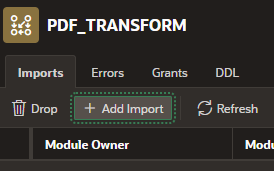

# Unlock the power of Node.js Code inside 23ai
In this video we will show how to quickly created a node.js function that inputs a pdf and outputs the number of pages inside the pdf as well as parses out a page in the pdf. We will then load this code directly into the 23ai database and show how easy it is to create oracle database functions on the node.js code that can be executed inside your database. 

This video and instructions assumes that the user: 

Has a 23ai autonomous database running on Oracle Cloud Infrastructure. 
Has developer access to an apex workspace.
Has created an object storage bucket and a cloud credintial to access the bucket from your apex user. (How to create an Auth Token and Bucket)[https://youtu.be/CvyzCjdDvTU]
Has Node.js installed locally able to execute in Visual Studio.

## 23ai Database Setup
- Create a new bucket and capture the namespace & name in the fields below for future reference.
```
Namespace: 
Bucket name: 
```

-- Grant the following to your user. In my example I have an apex workspace called vector with the database user vector. 
```
grant execute dynamic mle to vector;
grant execute on javascript to vector;
grant create mle to vector;
grant db_developer_role to vector;
```

-- Create the following table
```
 CREATE TABLE "DOCUMENTS" 
   (	"ID" NUMBER(*,0) GENERATED BY DEFAULT ON NULL AS IDENTITY MINVALUE 1 MAXVALUE 9999999999999999999999999999 INCREMENT BY 1 START WITH 1 CACHE 20 NOORDER  NOCYCLE  NOKEEP  NOSCALE  NOT NULL ENABLE, 
	"FILE_NAME" VARCHAR2(900), 
	"FILE_SIZE" NUMBER(*,0), 
	"FILE_TYPE" VARCHAR2(100), 
	"FILE_CONTENT" BLOB, 
	 PRIMARY KEY ("ID")
  USING INDEX  ENABLE
   );
```

-- Test to see if you have a database credintial created. If not please review and create before proceeding. ()[]
```
SELECT credential_name, username, comments FROM all_credentials;
```

-- Upload pdfs and test to see if you can view your pdf's in your bucket. 
```
select * from dbms_cloud.list_objects('<cloud credintial>','https://objectstorage.us-ashburn-1.oraclecloud.com/n/<bucket namespace>/b/<bucket name>/o/') where object_name like '%.pdf'
ex.
select * from dbms_cloud.list_objects('CHIPSPICKS','https://objectstorage.us-ashburn-1.oraclecloud.com/n/id9ju5cntedk/b/vectorfiles/o/') where object_name like '%.pdf'
```

-- Execute the following to load your documents from object storage into the database as a blob.
```
declare
   l_blob blob := null;
   l_bucket varchar2(4000) := 'https://objectstorage.us-ashburn-1.oraclecloud.com/n/id9ju5cntedk/b/vectorfiles/o/';
begin
for i in (select * from dbms_cloud.list_objects('CHIPSPICKS',l_bucket) where object_name like '%.pdf')
loop
   l_blob := dbms_cloud.get_object(
     credential_name => 'CHIPSPICKS',
     object_uri => l_bucket||i.object_name);
insert into documents (file_name, file_size, file_type, file_content) values(i.object_name, i.bytes, 'application/pdf',l_blob);
commit;
end loop;
end;
```

## Create your Node.js Code
Notes on steps to get code to run. 

-- Initialize json package
```
npm init -y
```

- List packages
```
npm list
```

- Install libraries
```
npm install pdf-lib
```

- Add Type Node Module to the package.json
```
"type":"module",
```

- If you hit the error on installing then run:
```
Get-ExecutionPolicy
```
Then
```
Set-ExecutionPolicy -Scope CurrentUser
```
Set to 
```
RemoteSigned
```


-- Create a index.js file

-- On local machine bundle up all the libraries required to execute the .js module. 
```
npx esbuild index.js --bundle --outfile=./pdf-transform-bundle.js --format=esm
```

- Inside APEX navigate to the object browser. Upload your bundle as a new module and name it PDFLIB_MODULE. 


- Create a MLE environment for your code base called PDF_TRANSFORM.


- Add a import to your environment. 



-- Open SQL Worksheet and Query to check mle_env is up and ready. 
```
SELECT ENV_NAME, LANGUAGE_OPTIONS FROM USER_MLE_ENVS WHERE ENV_NAME='PDF_TRANSFORM'
```


- Select all your documents and write down the ids for the next step. 
```
select * from documents
```


-- Test your function by executing a javascript code block in SQL Worksheet. Make sure to set the language and environment variables like below. Be sure to modify the block below to add your id. This block will return the number of pages in a pdf. 

 
```
const {pdfPageCountUnit8Array} = await import('pdflib-module');
const{oracledb} = await import ('mle-js-oracledb');

try {
const result = session.execute(
    `SELECT ID, FILE_NAME, FILE_CONTENT FILE_CONTENT FROM DOCUMENTS where id = <add your ID>`,
    [],{fetchInfo:{
            ID: {type: oracledb.STRING},
            FILE_NAME: {type: oracledb.STRING},
            FILE_CONTENT :{type: oracledb.UINT8ARRAY}
        },
    outFormat: oracledb.OUT_FORMAT_OBJECT});

for (let row of result.rows) {
    const pages = await pdfPageCountUnit8Array(row.FILE_CONTENT);
    console.log('ID: '+ row.ID + ' Filename: '+ row.FILE_NAME + ' Page Count: '+  pages);
}
}
catch (err) {
    return err.errorNum + " " + err.message;
}
```


-- Building your function ex. 23ai typescript syntax
```
create or replace function  pdfPageCount(inPDF in blob) return number
as mle module PDFLIB_MODULE env PDF_TRANSFORM signature 'pdfPageCountUnit8Array(Uint8Array)';
```

-- Leveraging function in a query
```
select id, file_name, file_size, pdfPageCount(file_content) "Pages" from documents where id = 45;
```

-- Query with function
```
select pdfPageCount(FILE_CONTENT) from documents;
```